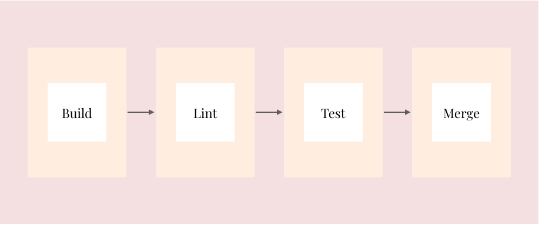

  
    
  <b>Make development faster!</b>
   

### Continuous Integration

The CI workflow consists of a single job called Build and Test that runs on ubuntu-latest. The job checks out the code submitted in the pull request, then installs all the dependencies, creates a build and runs all the tests once.

If any of the steps fail, the whole workflow fails and reports back to the pull request. As a best practice we always enforce the checks to succeed before allowing code to be merged.

### DevOps

- [x] React & AWS S3
- [ ] NPM Release
- [ ] Tags & Release notes
- [ ] React Native builds
